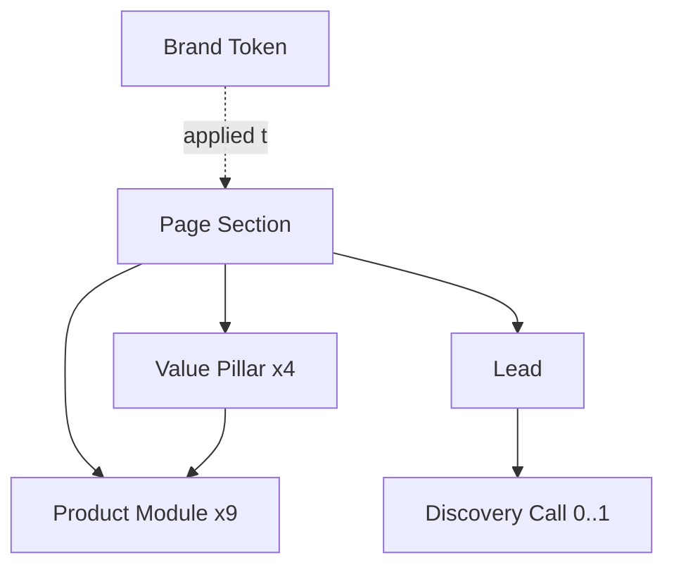

# Object Map — Green Loom Landing Page

**Dash:** green-loom-landing-2026-07 · **Date:** 2026-07-10

```text
┌──────────────────────────────┐
│ PAGE SECTION      (structural│
│                        hub)  │
├──────────────────────────────┤
│ type, heading, order,        │
│ content refs, edge states    │
├──────────────────────────────┤
│ Nests: Value Pillar (pillars)│
│        Product Module (suite)│
│        FAQ items (content)   │
│        Lead form (CTA)       │
└──────────────────────────────┘
        │                 ▲ applied-to
        │                 │
        │          ┌──────────────┐
        │          │ BRAND TOKEN  │  color / type / space
        │          └──────────────┘  → WP theme.json
        │
        ├──▶ VALUE PILLAR (4) ──▶ PRODUCT MODULE (9)
        │      title, promise        name, tagline, status,
        │      capability list       capabilities, pillar ref
        │
        └──▶ LEAD  (conversion hub)
               email, role, source_section,
               consent, status, created_at
                    │
                    └──▶ DISCOVERY CALL (0..1)
                           datetime, attendee,
                           lead ref, status
```

## Mermaid



## Object summary

| Object | Attributes | Nested | Visitor CTAs | Role |
|---|---|---|---|---|
| Page Section | 5 | 4 | 3 | Structural hub; WP block unit |
| Value Pillar | 4 | 1 | 0 | Value-prop organizer |
| Product Module | 5 | 0 | 1 | Suite communication |
| Lead | 6 | 1 | 2 | **Conversion hub** |
| Discovery Call | 5 | 0 | 1 | Qualified pipeline |
| Brand Token | 3 | 0 | 0 | Identity v0 → theme.json |
